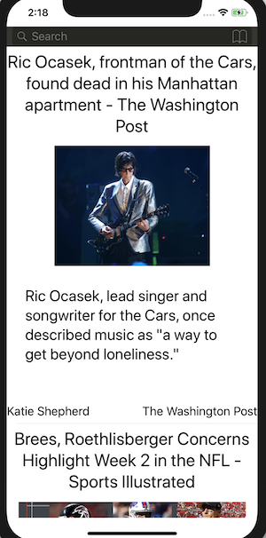

# News
> Show a list of news form news api

[![Swift Version][swift-image]][swift-url]

One to two paragraph statement about your product and what it does.

## Features

- [x] News Search
- [x] Filter by category/country/source
- [x] News sorted by date of publishing
- [x] UITableViewCell contain: source, author, title, description, Image
- [x] UIRefreshControl
- [ ] Pagination
- [x] Search and filter don't work together, because API doesn't allow it.

## Requirements

- iOS 10.0+
- swift 5

## Meta

Oleh Tyzhai – olehtyzhai@gmail.com

[swift-image]:https://img.shields.io/badge/swift-5.0-orange.svg
[swift-url]: https://swift.org/
